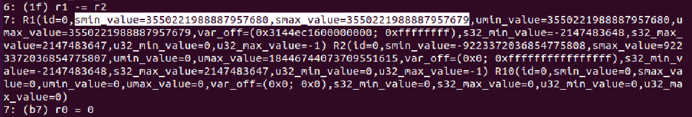
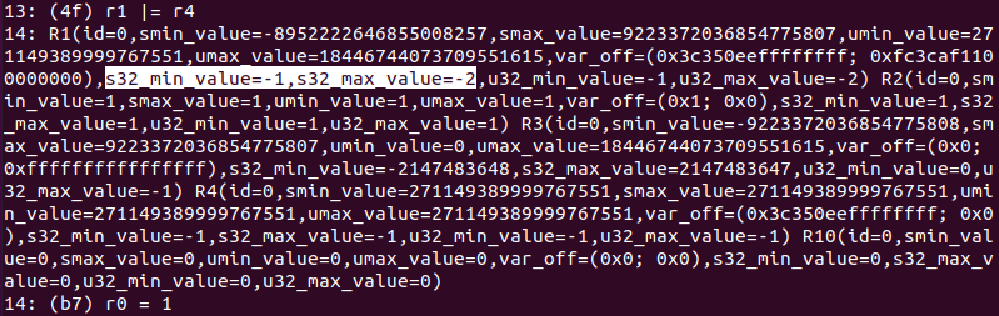

# Verifying the Verifier: eBPF Range Analysis Verification

## Abstract
This paper proposes an automated method to check the
correctness of range analysis used in the Linux Kernel’s
eBPF verifier. We provide the specification of soundness for
range analysis performed by the eBPF verifier. We
automatically generate verification conditions that encode
the operation of eBPF verifier directly from the Linux
Kernel’s C source code and check it against our
specification. When we discover instances where the eBPF
verifier is unsound, we propose a method to generate an eBPF
program that demonstrates the mismatch between the abstract
and the concrete semantics. Our prototype automatically
checks the soundness of 16 versions of the eBPF verifier in
the Linux Kernel versions ranging from 4.14 to 5.19. In this
process, we have discovered new bugs in older versions and
proved the soundness of range analysis in the latest version
of the Linux kernel.

--------------------------------------------------------------------------------

### Prerequisites to run the artifact.

1.  Install Docker if not already installed by following the
    documentation [here](https://docs.docker.com/install/).
    You might need to follow the post installation steps for
    managing docker as a non-root user
    [here](https://docs.docker.com/engine/install/linux-postinstall/#manage-docker-as-a-non-root-user).

2.  Install Virtual Box if not already installed by
    downloading from
    [here](https://www.virtualbox.org/wiki/Downloads).

### Claims to validate/reproduce.

1. Automatically extracting the semantics of the Linux
   kernel's C code to SMT (Docker).
2.  1. Verifying the kernel's range analysis using our `gen`
       and `sro` verification conditions (Docker).
    2. Synthesizing proof-of-concept BPF programs
       demonstrate a mismatch between the concrete and
       abstract semantics (Docker).
3.  Running our synthesized proof-of-concept BPF programs to
    witness unsound behaviour in a real Linux kernel
    (Virtual Box).

`Note`. To make it feasible to run the artifact quickly, we
have reduced the sample sizes used for the experiments. The
experiments for the paper were performed without using any
containers, and on larger inputs sizes. It should take
roughly 4-5 hours to evaluate this artifact. 

### Known issues.
We have tested the Docker image and the Virtual Box
appliance on `x86_64` machines, running Linux and Windows
operating systems.  We have no known issues to report.

--------------------------------------------------------------------------------

## (1.) Automatically extracting the semantics of the Linux kernel's C code to SMT (25 minutes)

Here, we demonstrate how our tool can be used to
*automatically* extract the semantics of the Linux Kernel
verifier's C code as described in our paper (§5). Our tool
produces the first-order logic formula (in
[SMT-LIB](https://smtlib.cs.uiowa.edu/papers/smt-lib-reference-v2.6-r2021-05-12.pdf)
format) for the abstract semantics defined in Linux Kernel
for each eBPF instruction. We demonstrate our tool on kernel
v5.9, the source code for which is present in
`/home/linux-stable/`

### Load and run the docker image
```
docker load < cav23-artifact-docker.tar  
docker run -it cav23-artifact
```

### Inside docker, create the output directory 
```
cd /home/cav23-artifact
mkdir bpf-encodings-5.9
```

### Run the llvm-to-smt tool 

```
cd /home/cav23-artifact/llvm-to-smt
python3 generate_encodings.py --kernver 5.9 --kernbasedir /home/linux-stable \
  --outdir /home/cav23-artifact/bpf-encodings-5.9
```

### Expected Result 
```
Log file: /home/cav23-artifact/bpf-encodings-5.9/log_21_58_27_04_2023.log
Log error file: /home/cav23-artifact/bpf-encodings-5.9/log_err_21_58_27_04_2023.log
Change to kernel directory: /home/linux-stable ... done
Checkout kernel version v5.9 ... done
Run make config and edit BPF flags ... done
Extract compile flags for current kernel version ... done
Edit tnum.c and verifier.c to add wrappers ... done
Compile verifier.c and tnum.c ... done
Link verifier.ll and tnum.ll to single verifier.ll ... done
Getting encoding for BPF_ADD ... done
Getting encoding for BPF_SUB ... done
Getting encoding for BPF_OR ... done
Getting encoding for BPF_AND ... done
Getting encoding for BPF_LSH ... done
.
.
.
Getting encoding for BPF_SYNC ... done
```

### Explanation
Our automatic encoder produces an SMT-LIB (`.smt2`) file for
each eBPF instruction in the output directory
(`/home/bpf-encodings-5.9`), that captures the Linux
Kernel's abstract semantics for the instruction.  We now
have the semantics of 36 abstract operators corresponding to
36 eBPF instructions.

```
root@847d5c0f8828:/home/cav23-artifact/llvm-to-smt# ls -1 /home/bpf-encodings-5.9/*.smt2
/home/bpf-encodings-5.9/BPF_ADD.smt2
/home/bpf-encodings-5.9/BPF_ADD_32.smt2
/home/bpf-encodings-5.9/BPF_AND.smt2
...
```

### Source code structure

```
llvm-to-smt
├── llvm-passes
│   ├── ForceFunctionEarlyExit
│   ├── InlineFunctionCalls
│   ├── LLVMToSMT
│   ├── PromoteMemcpy
│   ├── RemoveFunctionCalls
├── generate_encodings.py
├── run_llvm_passes.py
└── wrappers.py
```

The top-level script `generate_encodings.py` does the following:
- Checks out the provided kernel version 
- Edits `verifier.c` to add a stub function for each eBPF
  instruction we need an encoding in SMT for.
- Extracts the compile flags necessary to compile the eBPF
  verifier kernel module to llvm IR.
- Compiles `verifier.c` and `tnum.c` to `verifier.ll`.
- Runs the llvm passes from the `llvm-passes` subdirectory
  that transform the IR.
- Finally runs the `LLVMToSMT` pass for each eBPF
  instruction to obtain the SMT encoding for each eBPF
  instruction.

--------------------------------------------------------------------------------

## (2.1 & 2.2) Verification and POC synthesis for eBPF range analysis (3-4 hours)

We now check the correctness of the 36 abstract operators
using our verification conditions `gen` (§4.1) and `sro`
(§4.2). When our soundness checks fail, we synthesize
proof-of-concept (PoC) programs that demonstrate the
mismatch between abstract values maintained by the verifier
and the values in a concrete execution of the eBPF program.
To keep the experiment short, we will make the following
simplifications:

- We will only run the experiment for kernel v5.9
- For kernel v5.9, checking all the eBPF operators for
  soundness take a long time (~12 hours). In this
  experiment, we provide a script which will accept a
  reduced list of eBPF instructions whose abstract semantics
  are known to be unsound. The experiment will then confirm
  that the reduced list of eBPF instructions is indeed
  unsound.
- The synthesized PoC programs will be for demonstrative
  purposes only. Constructing a full eBPF program from our
  generated POCs requires some manual effort. For the
  review, we will forgo this step. In part 3, we directly
  provide full eBPF programs that manifest unsound behaviors
  in an actual kernel.

### Run the script to perform the verification and synthesis
The script uses the encodings we previously generated,
present in `/home/cav23-artifact/bpf-encodings-5.9`. The
`ver_set` argument is used to restrict our verification to a
reduced list of eBPF instructions.

```
cd /home/cav23-artifact/bpf-verification/src
python3 bpf_alu_jmp_synthesis.py --kernver 5.9 \
  --encodings_path /home/cav23-artifact/bpf-encodings-5.9 \
  --ver_set BPF_AND_32 BPF_SUB BPF_JGT BPF_JSLE BPF_JEQ BPF_JNE BPF_JSGT BPF_JSGE \
            BPF_OR_32 BPF_JLT BPF_OR BPF_AND BPF_JGE BPF_JSLT BPF_JLE 
```

### Expected result

The expected output should be similar to the one below. Note
that the order of instruction verification and synthesis
might differ but the tables should be the same.

```
--------------------------------------------------------------
                EXECUTING GEN VERIFICATION
--------------------------------------------------------------

1/15 Verifying BPF_JNE ...  Done.
2/15 Verifying BPF_JEQ ...  Done.
3/15 Verifying BPF_JLT ...  Done.
4/15 Verifying BPF_OR_32 ...  Done.
5/15 Verifying BPF_AND ...  Done.
6/15 Verifying BPF_JGE ...  Done.
7/15 Verifying BPF_JGT ...  Done.
8/15 Verifying BPF_JSGT ...  Done.
9/15 Verifying BPF_OR ...  Done.
10/15 Verifying BPF_SUB ...  Done.
11/15 Verifying BPF_AND_32 ...  Done.
12/15 Verifying BPF_JLE ...  Done.
13/15 Verifying BPF_JSGE ...  Done.
14/15 Verifying BPF_JSLE ...  Done.
15/15 Verifying BPF_JSLT ...  Done.
Gen Verification Complete
+-------------+--------+-----+-----+------+-----+-----+--------------------------+
| Instruction | Sound? | U64 | S64 | Tnum | U32 | S32 | Execution time (seconds) |
+-------------+--------+-----+-----+------+-----+-----+--------------------------+
|   BPF_JNE   |   ✘    |  ✘  |  ✘  |  ✘   |  ✘  |  ✘  |          192.43          |
|   BPF_JEQ   |   ✘    |  ✘  |  ✘  |  ✘   |  ✘  |  ✘  |          89.32           |
|   BPF_JLT   |   ✘    |  ✘  |  ✘  |  ✘   |  ✘  |  ✘  |          55.04           |
|  BPF_OR_32  |   ✘    |  ✘  |  ✘  |  ✓   |  ✘  |  ✘  |           5.18           |
|   BPF_AND   |   ✘    |  ✓  |  ✘  |  ✓   |  ✘  |  ✘  |           9.53           |
|   BPF_JGE   |   ✘    |  ✘  |  ✘  |  ✘   |  ✘  |  ✘  |          33.15           |
|   BPF_JGT   |   ✘    |  ✘  |  ✘  |  ✘   |  ✘  |  ✘  |          42.89           |
|   BPF_JSGT  |   ✘    |  ✘  |  ✘  |  ✘   |  ✘  |  ✘  |           28.4           |
|    BPF_OR   |   ✘    |  ✓  |  ✘  |  ✓   |  ✘  |  ✘  |           9.21           |
|   BPF_SUB   |   ✘    |  ✘  |  ✘  |  ✘   |  ✓  |  ✓  |          116.87          |
|  BPF_AND_32 |   ✘    |  ✘  |  ✘  |  ✓   |  ✘  |  ✘  |           5.28           |
|   BPF_JLE   |   ✘    |  ✘  |  ✘  |  ✘   |  ✘  |  ✘  |          62.81           |
|   BPF_JSGE  |   ✘    |  ✘  |  ✘  |  ✘   |  ✘  |  ✘  |          38.35           |
|   BPF_JSLE  |   ✘    |  ✘  |  ✘  |  ✘   |  ✘  |  ✘  |          32.33           |
|   BPF_JSLT  |   ✘    |  ✘  |  ✘  |  ✘   |  ✘  |  ✘  |          50.91           |
+-------------+--------+-----+-----+------+-----+-----+--------------------------+

--------------------------------------------------------------
                EXECUTING SRO VERIFICATION
--------------------------------------------------------------

1/15 Verifying BPF_JNE ...  Done.
2/15 Verifying BPF_JEQ ...  Done.
3/15 Verifying BPF_JLT ...  Done.
4/15 Verifying BPF_OR_32 ...  Done.
5/15 Verifying BPF_JGE ...  Done.
6/15 Verifying BPF_JGT ...  Done.
7/15 Verifying BPF_JSGT ...  Done.
8/15 Verifying BPF_OR ...  Done.
9/15 Verifying BPF_SUB ...  Done.
10/15 Verifying BPF_JSLE ...  Done.
11/15 Verifying BPF_AND_32 ...  Done.
12/15 Verifying BPF_JLE ...  Done.
13/15 Verifying BPF_JSGE ...  Done.
14/15 Verifying BPF_AND ...  Done.
15/15 Verifying BPF_JSLT ...  Done.
SRO Verification Complete
+-------------+--------+-----+-----+------+-----+-----+--------------------------+
| Instruction | Sound? | U64 | S64 | Tnum | U32 | S32 | Execution time (seconds) |
+-------------+--------+-----+-----+------+-----+-----+--------------------------+
|   BPF_JNE   |   ✘    |  ✘  |  ✘  |  ✘   |  ✘  |  ✘  |          203.43          |
|   BPF_JEQ   |   ✘    |  ✘  |  ✘  |  ✘   |  ✘  |  ✘  |         3911.46          |
|   BPF_JLT   |   ✘    |  ✘  |  ✘  |  ✘   |  ✘  |  ✘  |          74.94           |
|  BPF_OR_32  |   ✘    |  ✘  |  ✘  |  ✓   |  ✘  |  ✘  |          17.38           |
|   BPF_JGE   |   ✘    |  ✘  |  ✘  |  ✘   |  ✘  |  ✘  |          120.62          |
|   BPF_JGT   |   ✘    |  ✘  |  ✘  |  ✘   |  ✘  |  ✘  |          225.68          |
|   BPF_JSGT  |   ✘    |  ✘  |  ✘  |  ✘   |  ✘  |  ✘  |          114.93          |
|    BPF_OR   |   ✘    |  ✓  |  ✓  |  ✓   |  ✘  |  ✘  |          26.93           |
|   BPF_SUB   |   ✘    |  ✘  |  ✘  |  ✘   |  ✓  |  ✓  |          213.83          |
|   BPF_JSLE  |   ✘    |  ✘  |  ✘  |  ✘   |  ✘  |  ✘  |          79.36           |
|  BPF_AND_32 |   ✘    |  ✘  |  ✘  |  ✓   |  ✘  |  ✘  |          22.71           |
|   BPF_JLE   |   ✘    |  ✘  |  ✘  |  ✘   |  ✘  |  ✘  |          103.7           |
|   BPF_JSGE  |   ✘    |  ✘  |  ✘  |  ✘   |  ✘  |  ✘  |          95.13           |
|   BPF_AND   |   ✘    |  ✓  |  ✓  |  ✓   |  ✘  |  ✘  |          31.16           |
|   BPF_JSLT  |   ✘    |  ✘  |  ✘  |  ✘   |  ✘  |  ✘  |          71.92           |
+-------------+--------+-----+-----+------+-----+-----+--------------------------+

--------------------------------------------------------------
                VERIFICATION AGGREGATE STATISTICS
--------------------------------------------------------------

+---------+------------+------------+-----------+-----------+-----------------+-----------------+
| KernVer | Gen Sound? | Sro Sound? | Gen Viol. | Sro Viol. | Gen Unsound Ops | Sro Unsound Ops |
+---------+------------+------------+-----------+-----------+-----------------+-----------------+
|  5.9    |     ✘      |     ✘      |    67     |    65     |       15        |      15         |
+---------+------------+------------+-----------+-----------+-----------------+-----------------+

--------------------------------------------------------------
                GENERATING POC FOR DOMAIN VIOLATIONS
--------------------------------------------------------------


Synthesized program for BPF_JLT (signed_64). Instruction sequence: BPF_JLT 
Synthesized program for BPF_JLT (Tnum). Instruction sequence: BPF_JLT 
Synthesized program for BPF_JLT (unsigned_32). Instruction sequence: BPF_JLT 
Synthesized program for BPF_JLT (signed_32). Instruction sequence: BPF_JLT 
Synthesized program for BPF_JGE (signed_64). Instruction sequence: BPF_JGE 
Synthesized program for BPF_JGE (Tnum). Instruction sequence: BPF_JGE 
Synthesized program for BPF_JGE (unsigned_32). Instruction sequence: BPF_JGE 
Synthesized program for BPF_JGE (signed_32). Instruction sequence: BPF_JGE 
Synthesized program for BPF_JGT (signed_64). Instruction sequence: BPF_JGT 
Synthesized program for BPF_JGT (Tnum). Instruction sequence: BPF_JGT 
.
.
.
Synthesized program for BPF_OR_32 (unsigned_64). Instruction sequence: BPF_JSLE BPF_OR_32 
Synthesized program for BPF_OR_32 (signed_64). Instruction sequence: BPF_JSLE BPF_OR_32 
Synthesized program for BPF_OR_32 (unsigned_32). Instruction sequence: BPF_JSLE BPF_OR_32 
Synthesized program for BPF_OR_32 (signed_32). Instruction sequence: BPF_JSLE BPF_OR_32 
Synthesized program for BPF_OR (unsigned_32). Instruction sequence: BPF_JSLE BPF_OR 
Synthesized program for BPF_OR (signed_32). Instruction sequence: BPF_JSLE BPF_OR 

--------------------------------------------------------------
                SYNTHESIS AGGREGATE STATISTICS
--------------------------------------------------------------

+---------+--------------+-----------------------+------------+------------+------------+
| KernVer | # Tot. Viol. | All POCs Synthesized? | Prog Len 1 | Prog Len 2 | Prog Len 3 |
+---------+--------------+-----------------------+------------+------------+------------+
|  5.9    |    65        |           ✓           |    39      |     26     |     0      |
+---------+--------------+-----------------------+------------+------------+------------+
```

### Explanation
1) The first step of the experiment performs Gen verification on the set of
instructions - the table at the end denotes whether an instruction is deemed
sound (✓) or unsound (✘) and which of the five abstract domains have been
violated as well as execution time. 
2) The second step performs Sro verification on the instructions that are deemed
unsound by the gen verification and produces a similar table as in the prior
step. At the end of this step we also include an aggregate verification table
that denotes the soundness results of each verification with respect to number
of violations and the number of unsound operators in each.
3) The third step performs synthesis on unsound instructions returned by the
second step with the aim of producing a POC for each violation in every unsound
instruction. When a program is found the POC sequence is shown in minimal form.
Lastly we provide an aggregate synthesis table which denotes the amount of
violations to be synthesized and whether the synthesis was successful in
producing them all, as well as the respective program lengths.

### Long Version (Optional)
```
cd bpf_verification/src
python3 bpf_alu_jmp_synthesis.py --kernver 5.9 \
  --encodings_path /home/cav23-artifact/bpf-encodings-5.9
```

### Expected Result for Long Version
The two aggregate tables produced by the script, one for verification and one
for synthesis, should exactly match the specific row from the table (according
to kernel version) in Fig.5(a) and Fig.5(b), respectively.


### Source code structure
We use one script `bpf_alu_jmp_synthesis.py` to call three modules which perform
verification and synthesis. Two modules are used for performing verification,
one for gen (`wf_soundness.py`) and one for sro(`sync_soundness.py`), and one
more module for synthesis(`synthesize_bug_types.py`) - these can be found in the
src directory under bpf_verification. Each of these modules uses the encodings
produced by our llvm-to-smt procedure to verify instructions or synthesize POCs.
Our verification conditions and concrete semantics for bpf instructions are
contained within the `verification_synth_module` class included in the shared
module library called `lib_reg_bounds_tracking.py` under the
lib_reg_bounds_tracking directory. 

Our `bpf_alu_jmp_synthesis.py` script can be configured using various options
for verification and synthesis. These options can be changed by changing our
configuration `verification_synth_setup_config.toml` file or by passing argparse
arguments to the script which we show below, otherwise default values will be
assumed. While our experiment gives particular instructions for testing kernel
version 5.9, any kernel version, and any instruction of interest, can be tested
using our script `bpf_alu_jmp_synthesis.py`. For example, if we want to test one
instruction, `BPF_ADD`, in kernel version 5.10 we can use the following command:

```
python3 bpf_alu_jmp_synthesis.py --kernver 5.10 \
  --encodings_path <path to 5.10 encodings directory> \
  --ver_set BPF_ADD
```
If we want to test 2 instructions or more we add them sequentially as follows:
```
python3 bpf_alu_jmp_synthesis.py --kernver 5.10 \
  --encodings_path <path to 5.10 encodings directory> \
  --ver_set BPF_ADD BPF_OR BPF_AND 
```
We make a distinction between the verification set - which is the set of instructions used for verification and POC generation in case of failure - and the synthesis set which is solely used for synthesizing POCs for instructions given in the verification set. We set a default synthesis set which is able to produce POCs as described by our paper but can be changed in the following way:
```
python3 bpf_alu_jmp_synthesis.py --kernver 5.11 \
  --encodings_path <path to 5.11 encodings directory> \
  --ver_set BPF ADD --synth_set BPF_XOR BPF_OR
```
Changing the synthesis set in this case means that only those instructions (BPF_XOR and BPF_OR) will be used in a multi-sequence program when generating a POC for BPF_ADD. 

For more on config options, use the following command:
```
python3 bpf_alu_jmp_synthesis.py -h
```

## (3) Running synthesized eBPF programs in a real Linux Kernel

We saw some synthesized mini eBPF programs in the previous
experiment. We use these mini programs to construct a full
eBPF program that demonstrates a mismatch between abstract
values maintained by the verifier and the concrete execution
of the eBPF program. The process to construct a full eBPF
program requires some manual effort. Instead, we provide
these eBPF programs constructed by us using the output from
the synthesis inside our Virtual Box appliance
`cav23-artifact-vm.ova`. This appliance packages a virtual
machine that runs Ubuntu 20.04 installed with Linux Kernel
v5.9. 

### Import and start the virtual machine
- Open Virtual Box
- File > Import Appliance 
- Browse and select the path to cav23-artifact-vm.ova
- You should have the `cav23-artifact-vm` 





